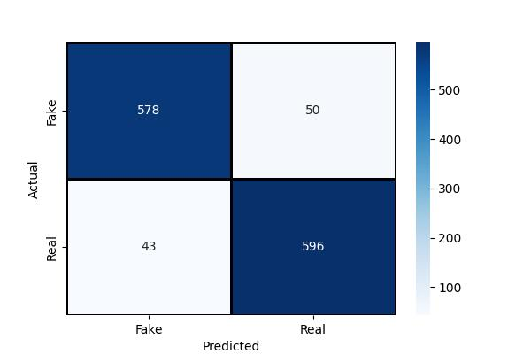

 <h1 align="center">Fake New Detection</h1>

## Introduction
This project aims to build a fake news detection model using machine learning techniques. The model analyzes the textual content and subject of news articles to classify them as either Fake or Real.

## Dataset

You can find this dataset at <a href="https://github.com/joolsa/fake_real_news_dataset">this link</a>

## Training
You can find at **train.py** and the trained model is at **trained model.pkl**

## Evaluation
### Classification Report
||precision|recall|f1-score|support|  
|-----------|:-----------:|:-----------:|:-----------:|:-----------:|
|Fake|0.93|0.92|0.93|628|
|True|0.92|0.93|0.93|639|
|accuracy|||0.93|1267|
|macro avg|0.93|0.93|0.93|1267|
|weighted|0.93|0.93|0.93|1267|
### Confunsion Matrix

## Requirements
* python
* pandas
* sklearn
* matplotlib
